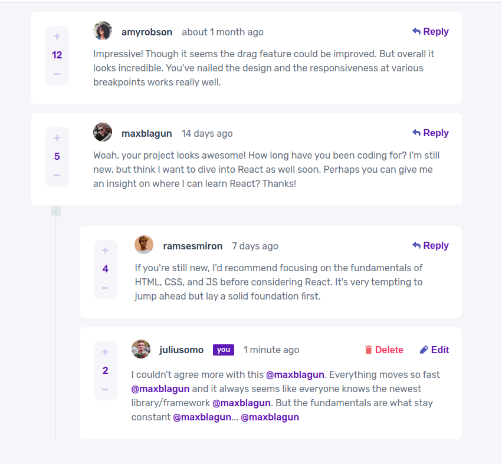

# Frontend Mentor - Interactive comments section solution

This is a solution to the [Interactive comments section challenge on Frontend Mentor](https://www.frontendmentor.io/challenges/interactive-comments-section-iG1RugEG9). Frontend Mentor challenges help you improve your coding skills by building realistic projects.

## Table of contents

-   [Overview](#overview)
    -   [The challenge](#the-challenge)
    -   [Screenshot](#screenshot)
-   [My process](#my-process)
    -   [About](#about)
    -   [Built with](#built-with)
    -   [What I learned](#what-i-learned)
    -   [Useful resources](#useful-resources)
-   [Author](#author)

## Overview

### The challenge

Users should be able to:

-   View the optimal layout for the app depending on their device's screen size
-   See hover states for all interactive elements on the page
-   Create, Read, Update, and Delete comments and replies
-   Upvote and downvote comments
-   **Bonus**: If you're building a purely front-end project, use `localStorage` to save the current state in the browser that persists when the browser is refreshed.
-   **Bonus**: Instead of using the `createdAt` strings from the `data.json` file, try using timestamps and dynamically track the time since the comment or reply was posted.

### Screenshot

### Links

-   Solution URL: [GitHub](https://github.com/WarlockJa/interactive-comments-section)
-   Live Site URL: [vercel](https://interactive-comments-section-1nzcshuxh-warlockja.vercel.app/)

## My process

### About
Important notice this project uses MongoDB database which is reinitialized every 30 minutes. So if you receive errors or some data is missing it might be that the timer has run out and you need to refresh the page. During the 30 minutes "grace period" you can refresh the page and see all your comments and ratings refetched. It is done to maintain db in close to the design look while allowing to demonstrate its function. I've took the liberty of adjusting design a little bit in order to highlight the process of independent data fetching for each reply branch. Also, this project is by design used by the same user on every connection, without protection from multiple instances of access to the DB, so I have no idea how that would work if several people changing data at once. Might be fun, likely to cause errors, chances of that actually happening - slim. Thank you for reading this!

### Built with

-   Semantic HTML5 markup
-   CSS custom properties
-   Flexbox
-   CSS Grid
-   Mobile-first workflow
-   Typescript
-   [React](https://reactjs.org/) - JS library
-   [Next.js](https://nextjs.org/) - React framework
-   [SCSS](https://sass-lang.com/) - CSS extension
-   [Zustand](https://github.com/pmndrs/zustand) - State manager
-   [TS-JEST](https://jestjs.io/) - Testing library
-   [MongoDB](https://www.mongodb.com/) - Non-relational database
-   [Prisma](https://www.prisma.io/) - ORM
-   [date-fns](https://date-fns.org/) - Date utility library

### What I learned

In this project I've tried to go for as many new things as possible such as NextJS app routes AND NextJS server actions. MongoDB working through Prisma. NextJS fetch cache and tags. React cache with use hook. This ended up very educational indeed, if not production ready.

My conclusions:

-   Prisma does not work well with MongoDB. It "supports" it. But I ended up dismantling original DB model and recreating relational-style set of collections in MongoDB in order to use Prisma functions like @updatedAt and @unique which is not what MongoDB was made for. In short you have an SQL db? Go for Prisma. With MongoDB stick to the native syntax.
-   React cache and use hooks have trouble dealing with cache invalidation, as in you can't do it. On top of that NextJS does not like cache hook, or indeed use hook and will throw errors while still working. Stick to SWR or React Query.
-   NextJS caching for fetch didn't work for me in this project. I've made it to somewhat work in the testing environment but even there there were issues with tags invalidation causing excessive glitches when reapplying css during rerendering and fetch request being fired anyway despite tags present. In the end I've conceded to a not pretty solution of storing data in Zustand store on the first fetch, which worked. Redux-query would make this a much better solution.
-   App routes and server actions. Both worked as expected, no issues to speak of. I would like to try making a project using server actions only, so it does not requre any js on the client side at all to fetch data.

## Author

-   Website - [warlockja](https://warlockja.ru)
-   Frontend Mentor - [@warlockja](https://www.frontendmentor.io/profile/WarlockJa)
